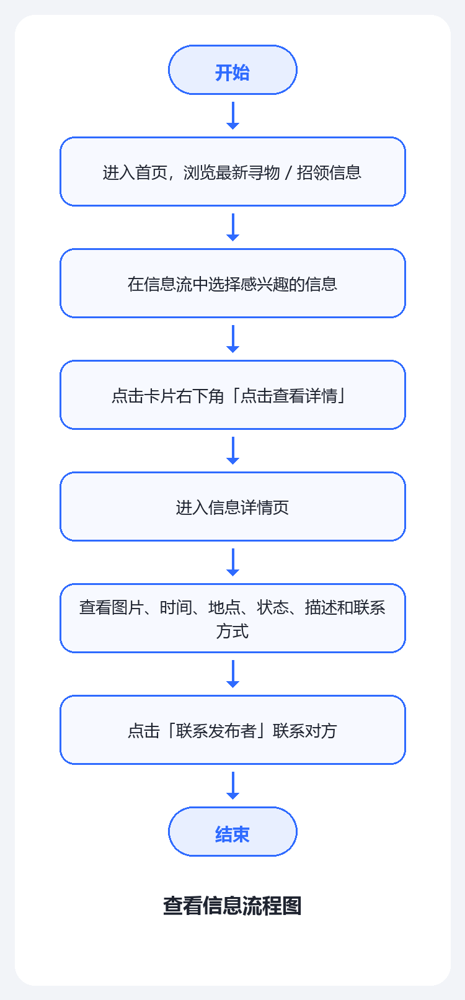
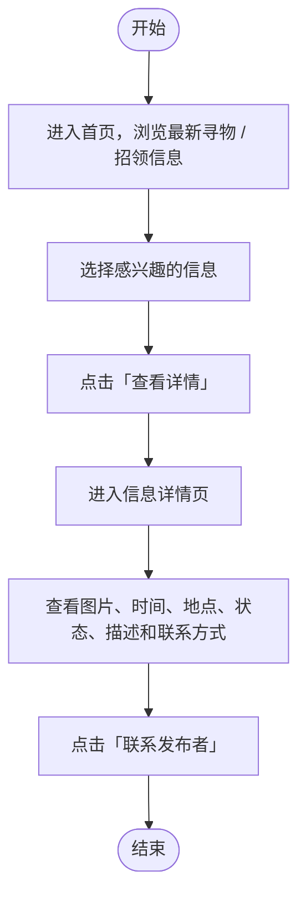
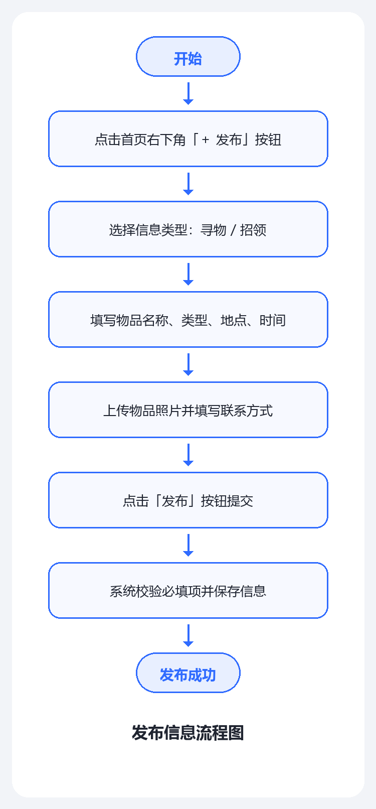
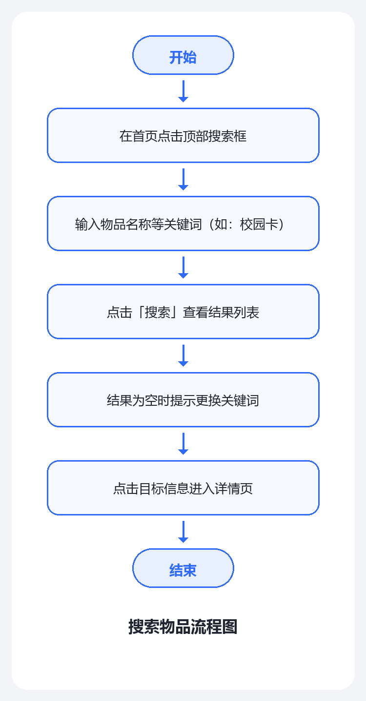
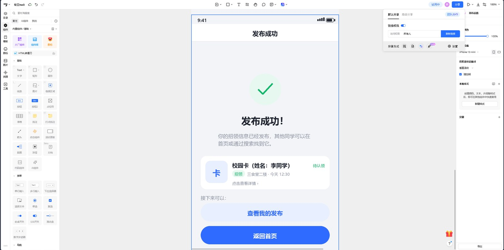
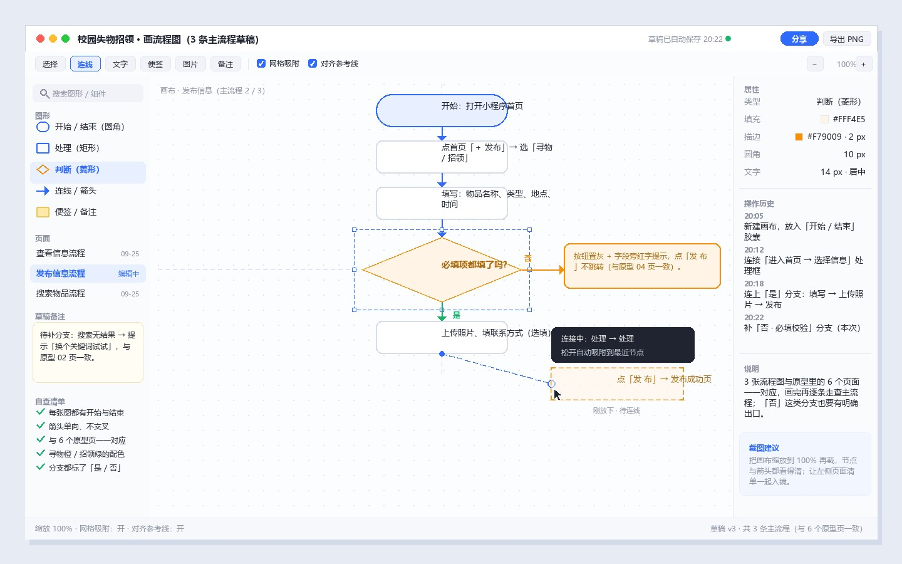

# 2026 秋软件工程第三次作业：校园失物招领小程序（需求分析与原型设计）

| 项目 | 内容 |
| --- | --- |
| 这个作业属于哪个课程 | H202601 软件工程与软件工程实践 |
| 这个作业要求在哪里 | 2026 秋软件工程个人作业（第三次）（结对，2 人） |
| 这个作业的目标 | 完成「校园失物招领」小程序的需求分析与原型设计，明确主要功能与用户流程，为后续编码打基础 |
| 学号 / 姓名 | 102402124 / 洪豊帧 |
| 成员二：学号 / 姓名 | 无（本次未找到搭档，全部工作由本人独立完成） |
| 原型工具 / 在线原型 | 墨刀（Modao）/ https://modao.cc/proto/5AmeweAStm2iuwqkXScZBn/sharing?view_mode=read_only&screen=rbpVWVSUILF2FBjjF |

> 正文约 1170 字；插图含 6 张原型图、3 张流程图与 1 张主流程演示动图。提交时间：2026-09-28

## 一、队伍分工

本次未找到搭档，全部工作由本人独立完成。为了不丢掉"配对"的好处，我把课程里的**驾驶 / 领航**做法保留下来：
每 40 分钟换一次角色——先当**驾驶员**动手画原型、写文档，再退回**领航员**视角，对着作业要求逐条查漏。

| 成员 | 学号 | 主要负责 | 同时参与 |
| --- | --- | --- | --- |
| 洪豊帧 | 102402124 | 需求分析、6 个页面原型、3 张流程图与演示动图、博客初稿 | 角色互换自查、原型走查、PSP 记录 |
| （暂无搭档） | 无 | 本次未组队；若后续组队会补上分工与个人总结 | —— |

## 二、软件构想与设计思路

我想做的不是"又一个群聊"，而是一个**公开、可检索的校园失物招领信息池**：
捡到东西的人与丢了东西的人不用认识、也不用在同一个群，只要在同一个池子里"发一条、搜一下"就能接上。

读完《构建之法》第 3 章和第 6 章后，我把思路收敛成三条原则：

1. **需求先落在场景里**：先写清"谁、什么时候、遇到什么问题"，再决定做不做某个功能；
2. **范围要克制**：只做"发布 → 检索 → 联系"这条最小闭环，后台管理、实名认证、即时聊天、地图定位明确不做；
3. **流程要简单**：发布不超过 3 步，首页一屏内看到搜索框、分类和信息流。

产品骨架因此是一条时间流：**首页信息流（浏览 / 搜索）→ 详情页 → 发布页 → 我的发布**。

## 三、需求分析

**（1）主要用户及其需求**

| 用户 | 典型场景 | 核心诉求 |
| --- | --- | --- |
| 失主：丢了东西的同学 | 在图书馆丢了钥匙，当天就想找回来 | 快速知道"有没有人捡到"，并且能马上联系上对方 |
| 拾得者：捡到东西的同学 | 在教学楼捡到一张校园卡 | 一次把时间、地点、描述写清楚，尽快物归原主 |
| 顺路浏览的同学 | 午休、睡前顺手刷一刷 | 不想翻聊天记录，搜一下就知道有没有自己的东西 |

**（2）软件主要解决什么问题**

现状是把信息发到班级群、宿舍群、朋友圈：**信息分散、跨班级看不到、被新消息顶掉、想找只能翻聊天记录**。

要解决的是三件事：**集中发布**（一个地方看全校失物招领）、
**关键词检索**（按物品名称直接搜）、**状态可更新**（归还后标记"已归还"）。

## 四、主要功能

| 功能 | 说明 | 优先级 |
| --- | --- | --- |
| 浏览失物和招领信息 | 首页信息流按时间倒序；顶部可切换「全部 / 招领 / 寻物」 | P0 |
| 发布寻物信息 | 选「寻物」类型，填写丢失物品的名称、类型、地点、时间 | P0 |
| 发布招领信息 | 选「招领」类型，填写拾取到的物品信息 | P0 |
| 搜索物品 | 按物品名称等关键词搜索，命中标题与描述 | P0 |
| 查看物品详情 | 图片、时间、地点、状态、描述、联系方式 | P0 |
| 修改信息状态 | 待认领 / 寻找中 / 已归还 / 已找到 | P1 |
| 我的发布（附加） | 集中管理自己发布的信息，可修改状态与删除 | P1 |

前 6 项覆盖了作业要求列出的功能点；「我的发布」是补充项，解决"发错了、已归还没法改"的问题。
**寻物用橙色、招领用绿色**，扫一眼就能分辨。

## 五、用户使用流程

### 1. 查看信息 → 查看详情

首页浏览信息 → 点卡片「点击查看详情」→ 详情页看图片、地点、时间、状态、描述和联系方式 → 点「联系发布者」。

同一张图的 mermaid 源码（博客园可直接渲染）：

### 2. 发布信息 → 发布成功

点首页「＋ 发布」→ 选类型 → 填名称、地点、时间 → 上传照片、填联系方式 → 点「发布」→ 进入发布成功页。

### 3. 搜索物品 → 查看搜索结果

点首页搜索框 → 输入关键词（如"校园卡"）→ 查看结果列表；结果为空时提示更换关键词。

### 4. 三条基本流程综合演示

> 动图按「首页 → 信息详情 → 发布信息 → 发布成功 → 搜索物品 → 我的发布」循环播放，每帧停 1.4 秒，
> 正好走完上面三条基本流程；同一个原型在 `prototype/index.html` 里可以真实点击走一遍。

## 六、原型设计

### 1. 原型工具与在线链接

原型使用 **墨刀（Modao）** 制作，在线链接：**https://modao.cc/proto/5AmeweAStm2iuwqkXScZBn/sharing?view_mode=read_only&screen=rbpVWVSUILF2FBjjF**

> 链接是墨刀的只读分享链接，**无需登录即可打开**；点页面里的卡片、按钮和底部导航，
> 就能走完「查看信息→查看详情 / 发布信息→发布成功 / 搜索物品→查看搜索结果」三条主流程。
> `prototype/index.html` 是同一份尺寸稿的 HTML 版可点击原型，双击也能演示主流程与必填校验等分支。

### 2. 页面清单

作业要求至少包含首页、发布信息、搜索、信息详情；我们另补了「发布成功」「我的发布」。

| 首页（信息流 + 搜索入口 + 分类） | 信息详情页（图片/时间/地点/状态/描述/联系方式） |
| --- | --- |
|  |  |

| 发布信息页（寻物 / 招领 + 表单） | 发布成功页（结果反馈 + 信息预览） |
| --- | --- |
|  |  |

| 搜索页（关键词 + 结果 + 空状态提示） | 我的发布（修改状态 / 标记已归还） |
| --- | --- |
|  |  |

设计上把握三点：**首页一屏给全入口**；**详情页按"是不是我的东西"排序**；
**状态用颜色加文案双重表达**（待认领绿、寻找中橙、已归还灰）。

### 3. 三条基本流程在原型中的走法

| 流程 | 起点 | 中间 | 终点 |
| --- | --- | --- | --- |
| 查看信息 → 查看详情 | 首页信息流 | 点击卡片「点击查看详情」 | 信息详情页，点「联系发布者」 |
| 发布信息 → 发布成功 | 首页「＋ 发布」 | 选类型 → 填表单 → 点亮「发布」 | 发布成功页，可去「我的发布」 |
| 搜索物品 → 查看搜索结果 | 首页顶部搜索框 | 输入"校园卡" → 查看结果列表 | 结果列表，点任一结果进详情页 |

### 4. 交互反馈与异常状态

> 原型不只有"一路顺利"的路径：下面几种打断情况都给了明确反馈，在 `prototype/index.html` 里点对应按钮就能看到
> （发布页的「清空试试 ›」用来演示"必填项未填"）。

| 状态 | 触发场景 | 界面反馈 |
| --- | --- | --- |
| 搜索结果为空 | 关键词没有命中任何信息 | 结果列表底部提示"没有更多结果了，换个关键词试试？" |
| 必填项未填 | 发布时"物品名称"等带 * 的字段为空 | 「发 布」按钮置灰，字段旁红字提示；点击不跳转，弹出"请先填写必填项" |
| 已加载全部 | 首页信息流翻到底 | 列表底部显示"已加载全部 · 共 126 条信息"，不再继续加载 |
| 发布成功 | 表单提交成功 | 跳转发布成功页：对勾 + 信息预览 + 「查看我的发布 / 返回首页」 |
| 状态修改成功 | 在详情页或「我的发布」改状态 | 提示"已标记为「已归还」"，详情页状态标签同步变灰 |
| 联系方式保护 | 点「联系发布者」 | 复制联系方式并提示，不在详情页直接摊开号码 |

## 七、结对过程（本次为单人独立完成）

本次未组队，由本人独立完成；为了避免"自己骗自己"，我把角色拆成两步走：先做（驾驶），再退回检查（领航）。

| 日期 | 阶段 | 做了什么 | 产出 |
| --- | --- | --- | --- |
| 09-23 | 读题与需求 | 逐条读要求，圈出"必须做"与"明确不做"，梳理用户与痛点 | 要求清单、需求分析 |
| 09-25 | 设计与原型 | 定页面结构、状态与配色，搭 6 个页面并拉通 3 条主流程 | 原型图、可点击原型 |
| 09-27 | 评审与提交 | 退回"领航员"视角自查是否覆盖要求第 4、5 条，核对字数与错别字 | 修改记录 |

> 图 1：做原型时的界面——在**墨刀**里调「发布成功」页，并顺手把「分享」面板的連結權限设为
> 「所有人」（对应作业要求第 2 条的可分享原型、第 11 条的过程截图）。

> 图 2：画流程图的过程——在画布上摆节点、连「是」分支、再补上「否 · 必填校验」分支的草稿；
> 「五、用户使用流程」里的 3 张流程图就是照这张草稿画的（脚本可复现，见文末配套文件）。

两个最有价值的发现都来自"退回检查"这一步：失物与招领不该做成两个独立入口（用户只关心"有没有我的东西"），
以及详情页直接展示联系方式会泄露隐私（改为仅登录可见）。文档与原型源文件按作业要求第 15 条用 GitHub 管理。

## 八、PSP 表格

> 说明：「预估」是开工前估的；「实际」是提交前回填的真实投入——**预估 490 分钟、实际 650 分钟**，
> 多出来的时间几乎都在没做过的事情上（原型细节打磨、插图和字数自检），与 `docs/PSP.md` 是同一份数据。

| 阶段 | 任务 | 预估（分钟） | 实际（分钟） | 说明 |
| --- | --- | --- | --- | --- |
| 计划 | 读作业要求、读《构建之法》第 3、6 章、拆需求；定范围与分工 | 50 | 65 | 圈出 15 条要求与"不做"清单，比预估多 15 分钟 |
| 需求 | 用户与痛点、用户故事、用例与功能清单、非功能需求 | 70 | 95 | 4 类用户、7 条用户故事、4 个用例；入口拆分返工一次 |
| 设计 | 页面结构与信息架构、状态与配色约定 | 45 | 40 | 首页/搜索/详情/发布/成功/我的，比预估省 5 分钟 |
| 原型 | 必需 4 个页面（首页、发布、搜索、详情） | 90 | 130 | 配色与间距调三轮 + 详情页为隐私重排，**最花时间** |
| 原型 | 补充「发布成功」「我的发布」 | 40 | 55 | 成功页要兼顾「分享」引导，改了两版 |
| 原型 | 流程图 3 张 | 45 | 70 | 查看信息 / 发布信息 / 搜索；第一张漏「否」分支重画一次 |
| 测试 | 三条主流程逐条走查；必填校验、状态切换等分支回归 | 30 | 45 | 渲染 + 交互共 12 项断言，图片做像素自检 |
| 文档 | 博客初稿（800–1200 字 + 插图） | 60 | 85 | 插图尺寸要统一 + 正文压进 1200 字，来回改三次 |
| 文档 | 自查评审、改错别字与排版 | 30 | 40 | 无搭档，改成对着 15 条要求逐条自查、改错别字 |
| 总结 | 个人总结 | 30 | 25 | 顺着前面的返工记录写，比预估快 |
| 合计 | | **490** | **650** | 约 10.8 小时（比预估多 33%） |

## 九、个人总结

### 洪豊帧（学号 102402124）

最大的收获是**明白了需求分析到底在做什么**。我一开始把"失物"和"招领"做成两个独立入口，总觉得别扭；
后来按《构建之法》的方法先写"谁、在什么场景下、遇到什么问题"，才反应过来用户只关心"有没有我的东西"，
于是合并成一条信息流加类型筛选。

第二点是**"退回检查"能挡住自己的盲区**。画完原型容易顺着自己的思路看下去，换成"领航员"视角
对着 15 条要求逐条查漏，才发现发布表单要滚动两次才点得到"发布"、详情页摊开联系方式有隐私风险；
画流程图时又发现"搜索无结果"这条分支完全没写——用户搜不到会以为程序坏了，补上"提示更换关键词"。

取舍上，功能列了十几个只留 P0 六项，标准是"不做这一项，用户的困扰还算不算解决"；
PSP 里预估 490 分钟、实际 650 分钟，多出来的几乎都在没做过的事上（原型细节、图片与字数自检）。
下次我会先写验收标准再动手，并把重复劳动继续脚本化。

## 附：本次作业的配套文件

| 文件 | 内容 |
| --- | --- |
| `docs/需求分析.md` | 完整的用户画像、用户故事、用例、功能清单与非功能需求 |
| `prototype/screenshots/` | 6 张原型图 + 3 张流程图 + 1 张主流程演示动图（博客插图的原始文件；另有两张过程截图直接放在 `blog/img/`） |
| `prototype/index.html` | 可点击原型（与墨刀版同一份尺寸稿），双击即可演示三条主流程与必填校验等分支 |
| 墨刀在线原型 | https://modao.cc/proto/5AmeweAStm2iuwqkXScZBn/sharing?view_mode=read_only&screen=rbpVWVSUILF2FBjjF（只读分享，无需登录） |
| `prototype/prototype.py`、`flowcharts.py`、`demo_gif.py` | 原型图、流程图、演示动图的生成脚本（可复现，便于迭代） |
| `tools/` | 一键重建与自检脚本（`build.py`、过程截图准备、图片像素探针、字数统计、原型渲染回归） |
| `docs/PSP.md` | PSP 时间记录的完整版 |
| `docs/结对过程.md` | 制作过程记录（含过程截图与 GitHub 提交记录的说明） |

> 正文（不含表格、代码与大段说明文字）约 1170 字，符合作业要求的 800–1200 字。

